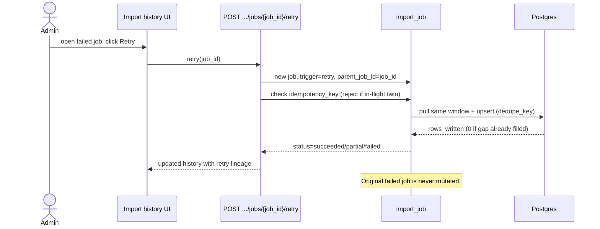

# Sequence Diagrams — Weather Provider Framework (Architecture Freeze)

> **Planning/documentation only.** Mermaid sequence diagrams.
> Build tags: **[BUILT]** Phases A–D, **[DESIGNED]** D.5.
> Every flow that pulls data passes through `_resolve_provider_pull_context`
> (catalog + licensing + durability gates). None of these flows touch
> `WeatherResolver`, expected math, or baselines.

---

## 1. Preview (dry-run) — [BUILT]

Preview validates gates and computes the pull **plan** (metrics, chunk plan, gap-fill,
remaining rate-limit) plus the context-only verdict — writing **nothing** and
**calling no provider**. It is also the "re-preview a window" tool (operator passes an
explicit prior window).

```mermaid
sequenceDiagram
    actor Admin
    participant FE as Telemetry tab UI
    participant API as POST /sites/{id}/provider-import/preview
    participant CTX as _resolve_provider_pull_context
    participant ADP as Provider adapter
    Admin->>FE: choose provider + window, click Preview
    FE->>API: preview(window)
    API->>CTX: resolve (catalog is_enabled? licensing ack? durability?)
    CTX-->>API: ok (or 4xx blocked)
    API->>ADP: construct adapter (NO network fetch)
    API->>API: plan metrics + chunks + gap-fill + rate-limit remaining
    API-->>FE: ProviderImportPreviewResponse (plan + context-only verdict)
    Note over API: Calls no provider; no job, batch, or observations created.
```

---

## 2. Import (write) — [BUILT] wrapped by [DESIGNED] job

The real pull. Gated, then persists an immutable batch + idempotent observations. The
D.5 job record wraps the attempt.

```mermaid
sequenceDiagram
    actor Admin
    participant API as POST /sites/{id}/provider-import
    participant JOB as import_job [DESIGNED]
    participant CTX as _resolve_provider_pull_context
    participant ADP as Provider adapter
    participant DB as Postgres (batches + observations)
    Admin->>API: import(window)
    API->>JOB: create job (queued) + idempotency_key
    JOB->>JOB: lock site/provider, status=running
    API->>CTX: resolve gates
    CTX-->>API: ok
    API->>ADP: pull window
    ADP-->>API: rows (ghi/ambient/unknown)
    API->>DB: insert batch (immutable) + observations (ON CONFLICT DO NOTHING)
    DB-->>API: rows_written (0 if already present)
    API->>JOB: status=succeeded/partial/failed, link batch_id
    API-->>Admin: ProviderImportResponse (context-only summary)
    Note over DB: physics_usable_rows = 0; resolver untouched.
```

---

## 3. Retry (failed/partial) — [DESIGNED]

Retry re-runs the **same window** as a new job linked to the original. Idempotency
makes already-present rows a no-op.



---

## 4. Safe disable — [DESIGNED]

Disabling blocks future pulls but **retains all data**; context and history still
render. Recorded in the append-only audit ledger.

```mermaid
sequenceDiagram
    actor PlatformAdmin
    participant API as POST /providers/{key}/disable
    participant CAT as weather_provider_catalog
    participant AUD as catalog_audit (append-only)
    participant CTX as _resolve_provider_pull_context
    PlatformAdmin->>API: disable(rationale)
    API->>CAT: is_enabled=false
    API->>AUD: append {action: disable, from, to, actor, rationale}
    Note over CTX: subsequent imports fail the catalog gate
    CTX-->>CTX: future pull blocked (no data deleted)
    API-->>PlatformAdmin: disabled; existing batches/observations intact
```

---

## 5. Replay (DR / gap fill) — [BUILT idempotency] + [DESIGNED job]

Re-import a window to recover/verify coverage. Safe by construction; produces a new
job/batch, not a reproduction of the original lineage (ADR-0005).

```mermaid
sequenceDiagram
    actor Operator
    participant API as POST /sites/{id}/provider-import
    participant JOB as import_job [DESIGNED]
    participant DB as Postgres
    participant INT as GET .../integrity [DESIGNED]
    Operator->>API: import(historical window)
    API->>JOB: new job (trigger=manual/retry)
    JOB->>DB: upsert observations (ON CONFLICT DO NOTHING)
    DB-->>JOB: rows_written = 0 (already present) or N (true gap)
    JOB-->>Operator: succeeded
    Operator->>INT: verify
    INT-->>Operator: recovered coverage == expected; row_count vs observations consistent
    Note over DB: No duplicate rows ever; coverage != batch identity.
```

---

## 6. Rollback (deploy / migration) — [DESIGNED]

Graduated rollback that never loses data. Instant disable first; deeper steps only if
needed.

```mermaid
sequenceDiagram
    actor Operator
    participant API as POST /providers/{key}/disable
    participant Deploy as Deploy pipeline
    participant Alembic as alembic downgrade
    participant DB as Postgres
    Operator->>API: 1. disable provider (instant, no data loss)
    API-->>Operator: pulls blocked; data retained
    Operator->>Deploy: 2. (optional) revert FE/backend deploy
    Deploy-->>Operator: prior version serving; batches/observations readable
    Operator->>Alembic: 3. (optional) downgrade migration
    Alembic->>DB: drop nullable columns + new tables (job, catalog_audit)
    DB-->>Operator: observations/batches retained; resolver/expected untouched throughout
    Note over DB: Each step is independent; stop at the lowest sufficient level.
```
