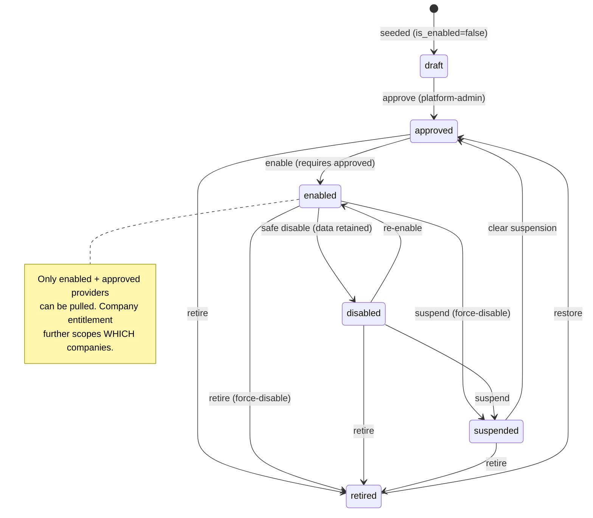
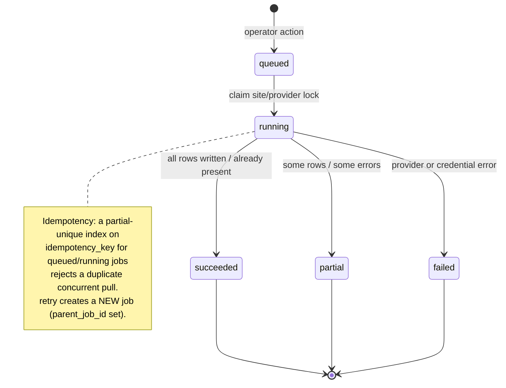
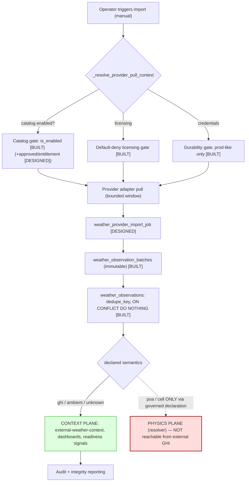
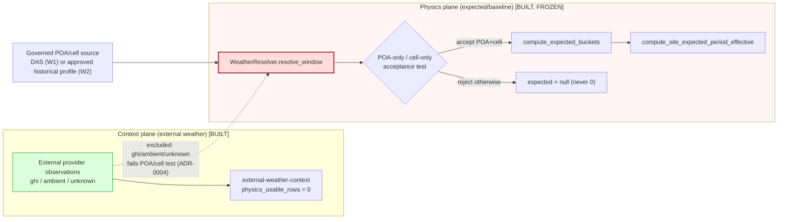
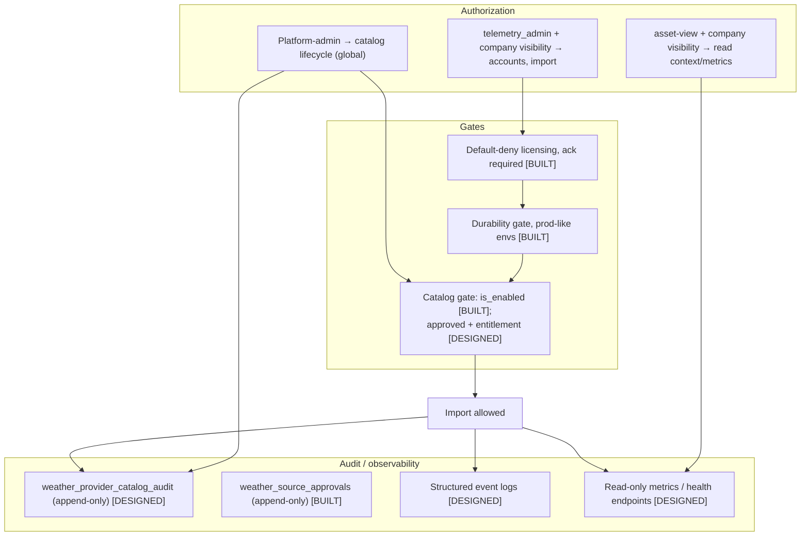

# System Diagrams — Weather Provider Framework (Architecture Freeze)

> **Planning/documentation only.** Diagrams are Mermaid (render in markdown).
> Build tags: **[BUILT]** Phases A–D, **[DESIGNED]** D.5, **[FUTURE]** Phase E.
> The single most important diagram is **§4 Resolver Boundaries** — it shows the
> structural line that keeps external weather context-only.

---

## 1. Provider lifecycle (catalog) — [DESIGNED, D.5a]

Catalog entries are **global** and start disabled + unapproved. Enabling requires
approval. Disable/suspend/retire never delete data. Rollback of a transition is a new
reverse transition recorded in the append-only audit ledger.

---

## 2. Import lifecycle (job) — [DESIGNED, D.5a]

Jobs run **synchronously** (no scheduler). Triggers are manual / retry / re_preview
only. A job references the immutable batch it produced.

---

## 3. Provenance flow — [BUILT] with [DESIGNED] job overlay

How a pull becomes auditable context. Note the terminal split: data lands in the
**context plane**, never the **physics plane**.

---

## 4. Resolver boundaries (THE freeze) — [BUILT]

The hard line. External `provider_pull` observations (`ghi/ambient/unknown`) are
visible to context surfaces but are **not selectable** by `WeatherResolver`: it selects
only governed POA/cell sources — DAS streams (W1) or an approved POA/cell historical
profile (W2) — and applies a POA-only / cell-only acceptance test that GHI/ambient data
cannot pass. (The resolver is not blind to all of `weather_observations`; it is blind to
*provider GHI/ambient* data specifically.)

---

## 5. Operational governance — [BUILT gates] + [DESIGNED lifecycle/audit]

The control plane around the data plane: authorization scope, the three gates, and
the append-only audit trail.

